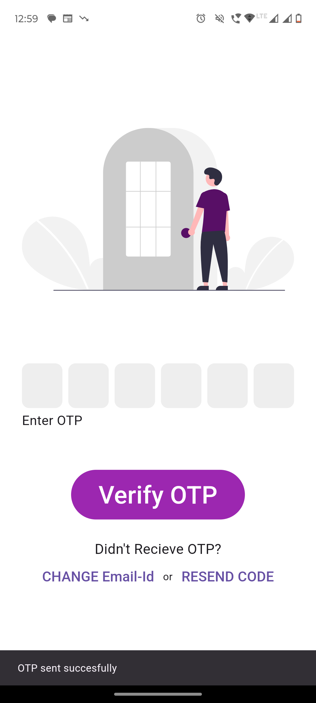
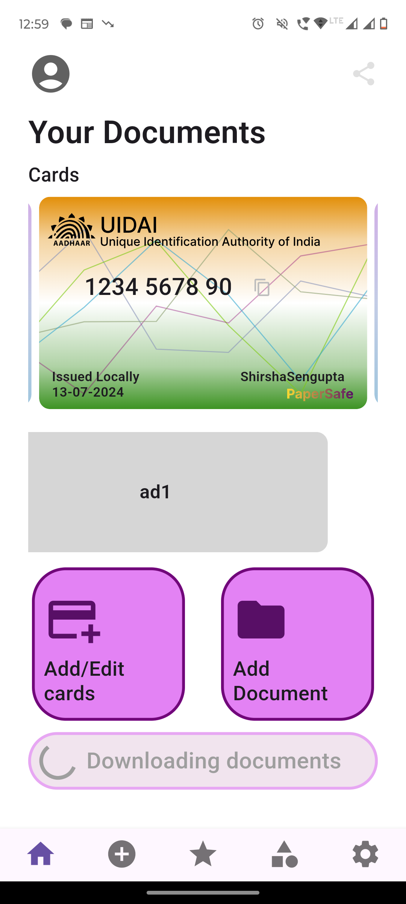
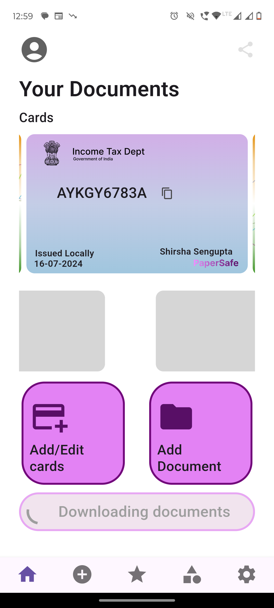
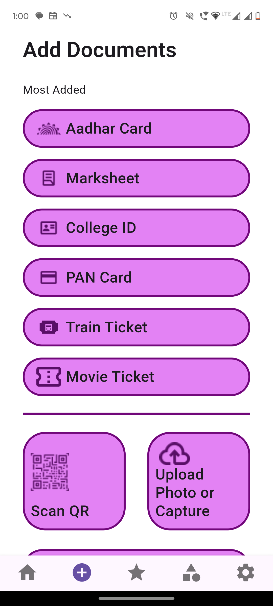
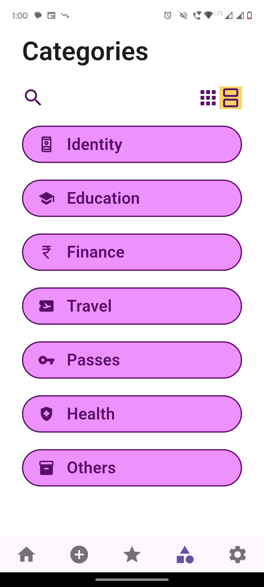
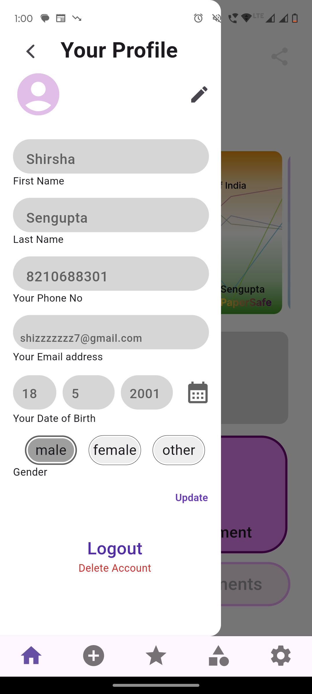
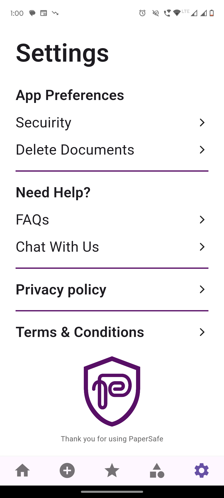

# PaperSafe

**PaperSafe** is a digital document wallet designed to securely store and manage important personal documents. Built using a monolithic architecture with Node.js, Express.js, MongoDB, and Flutter, it offers secure image storage with AES-256-CBC encryption and cloud hosting.

## Features

- **Secure Storage:** Keep Aadhaar Card, PAN Card, 10th Mark Sheet, 12th Mark Sheet, and multiple train and movie tickets.
- **Email OTP Authentication:** Users can sign up and log in using an email-based OTP system.
- **Document Encryption:** Encrypt images using AES-256-CBC before uploading to Cloudinary.
- **Best Practices:** Adheres to best practices in database design using MongoDB’s reference data model.

## Tech Stack

- **Backend:** Node.js, Express.js
- **Frontend:** Flutter, React.js
- **Database:** MongoDB
- **Cloud Storage:** Cloudinary
- **Encryption:** AES-256-CBC

## Table of Contents

- [Features](#features)
- [Tech Stack](#tech-stack)
- [Installation](#installation)
- [Usage](#usage)
- [Screenshots](#screenshots)
- [Demo Video](#demo-video)
- [Folder Structure](#folder-structure)
- [Contributing](#contributing)

## Installation

### Prerequisites

- [Node.js](https://nodejs.org/) v12 or higher
- [Flutter](https://flutter.dev/) v2 or higher
- [MongoDB](https://www.mongodb.com/) instance
- [Cloudinary](https://cloudinary.com/) account

### Backend Setup

1. Clone the repository:

    ```sh
    git clone https://github.com/shirshasengupta50/PaperSafe.git
    cd PaperSafe/server
    ```

2. Install dependencies:

    ```sh
    npm install
    ```

3. Create a `.env` file with the following variables:

    ```env
    PORT= 5555
    MONGODB_URI=your-mongodb-uri
    CLOUDINARY_CLOUD_NAME=your-cloudinary-cloud-name
    CLOUDINARY_API_KEY=your-cloudinary-api-key
    CLOUDINARY_API_SECRET=your-cloudinary-api-secret
    ENCRYPTION_KEY=your-encryption-key
    IV=your-iv
    EMAIL_ID=your-emailid
    EMAIL_PASSKEY=your-passkey
    ```

4. Start the server:

    ```sh
    npm start
    ```

### Frontend Development Status

**Note :** The client-side of PaperSafe is currently under active development.

<!-- ### Frontend Setup

1. Navigate to the client directory:

    ```sh
    cd ../client
    ```

2. Install dependencies:

    ```sh
    flutter pub get
    ```

3. Configure API endpoints in the Flutter app as needed.

4. Run the Flutter app:

    ```sh
    flutter run
    ``` -->

## Usage

1. Open the app.
2. Sign up using your email.
3. Log in using the OTP sent to your email.
4. Upload and manage your documents.

## Screenshots

### Login Screen



### Dashboard



### Document Upload


### Document List


### User Update


### Settings


### Database Schema


### Technical Flow Diagrams


## Demo Video

Watch a demo of PaperSafe in action:

### Link : https://www.youtube.com/watch?v=2oC5YGqQuwY&list=PL9C9-g_IdH7hYjITh443993h5Vj5bTJTA&index=4


## Folder Structure

```plaintext
PaperSafe/
│
├── client/               
│
├── server/               # Node.js backend code
│   ├── src/
│   ├── .env              # Example environment file
│   ├── package.json
│   └── README.md
│
├── screenshots/          # Screenshots and demo video thumbnail for the main README
│
└── README.md             # Main project README
```


### Contributing

Contributions are welcome! Please follow these steps:

1. Fork the repository.

2. Create a new branch 
```sh
git checkout -b feature-branch
```

3. Make your changes.

4. Commit your changes 
```sh 
git commit -m 'Add some feature'
```

5. Push to the branch 
```sh
git push origin feature-branch
```

6. Open a pull request.
